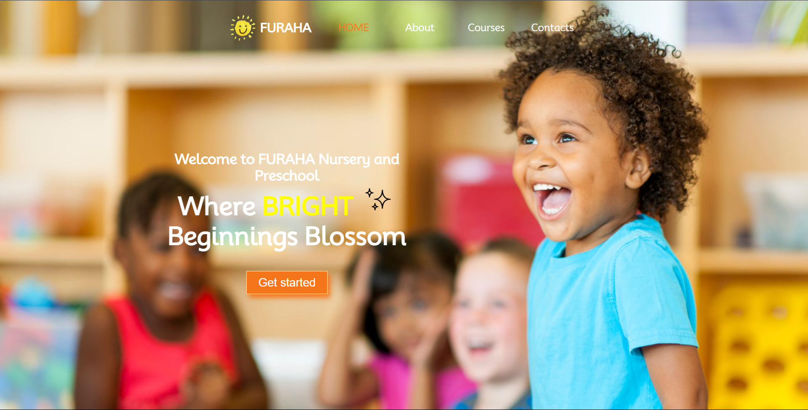
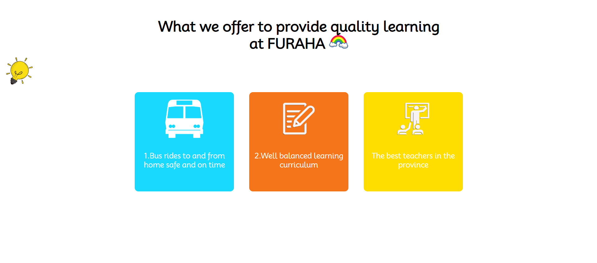
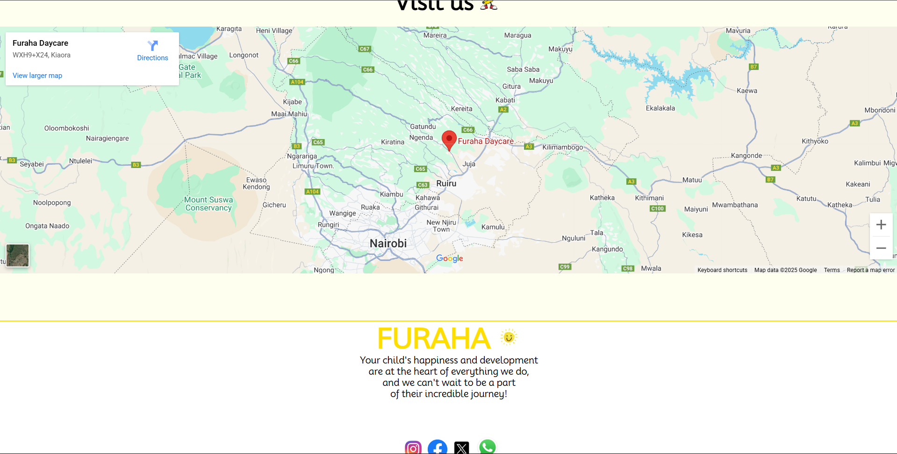
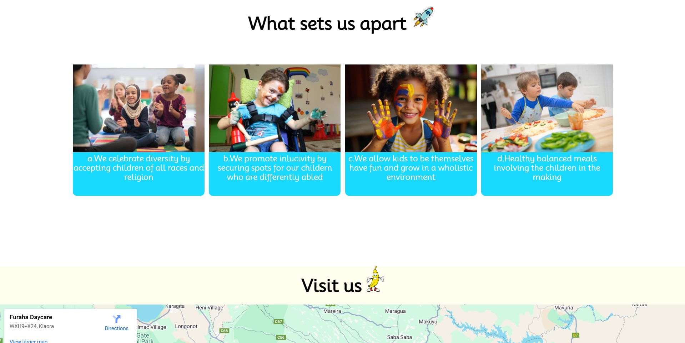

# Furaha Nursery and Preschool Website


A bright, welcoming website for Furaha Nursery and Preschool showcasing our programs, facilities, and educational philosophy.

## Table of Contents
- [Screenshots](#screenshots)
- [Features](#features)
- [Website Sections](#website-sections)
- [Technologies Used](#technologies-used)
- [Installation](#installation)
- [Usage](#usage)
- [License](#license)
- [Contact](#contact)

## Screenshots

| Section | Preview |
|---------|---------|
| **Landing Page** |  |
| **About Us** |  |
| **Why Choose Us** |  |
| **Location Map** |  |
| **Programs** |  |

## Features

- **Responsive Design**: Optimized for all devices (desktop, tablet, mobile)
- **Interactive Navigation**: User-friendly menu system with smooth scrolling
- **Visual Showcase**: Photo galleries highlighting our facilities and activities
- **Contact Integration**: Interactive map and contact form
- **Social Media**: Quick links to all our social platforms

## Website Sections

1. **Home**: Welcoming introduction to our school
2. **About**: Our mission, values, and educational approach
3. **Programs**: Age-appropriate curriculum and activities
4. **Contact**: Location map, contact form, and visiting hours

## Technologies Used

- **Frontend**: HTML5, CSS3, JavaScript
- **Icons**: Boxicons
- **Maps**: Google Maps API
- **Responsive Framework**: Flexbox/Grid layout

## Installation

To run locally:

1. Clone the repository:
```bash
git clone https://github.com/jodawa123/Furaha-Nursery-Website.git
cd Furaha-Nursery-Website